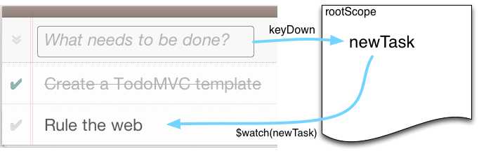
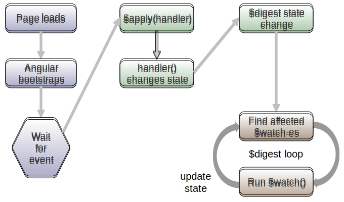
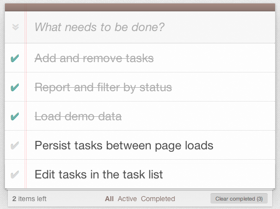
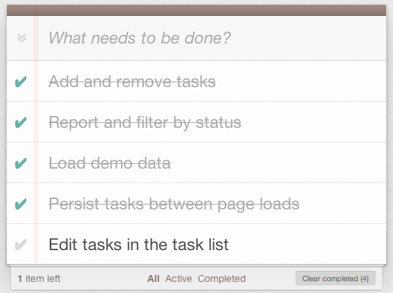

class: center, middle, title

# Introduction to AngularJS

## Chris Tucker, Will Leingang
### ServiceNow Core (Platform) UI Team
---

# Goals of this training

* Familiarize everyone with Angular techniques and terminology
* Gain hands-on experience writing an Angular application
* Learn how to write tested Angular code
* Understand how we integrate Angular into the ServiceNow platform

---

# How this will be organized

* Combination of three styles:
	* Presented overviews of aspects of Angular
	* Live development of features
	* Paired-up implementation of features by all of you

* Testing is an integral part of the course

* Code is all in a github repo

---

# Code and Node

Clone code from Github:

```terminal
$ git clone http://github.com/ctucker/angular-snc-training
```

Install NodeJS (for the testing framework):

* http://nodejs.org/ or `brew install node`

Check instructions in README.md file for more info

???

Pause to get everyone set up

---

# Glide: Security Manager & Plugins

Disable the security manager.

```terminal
-Dglide.security.policy=none
```

Add the plugic path to angular-snc-training:

```terminal
-Dglide.plugins.directories=$PATH:<new-path>
```

* IntelliJ: Run configuration, VM options
* Eclipse: Run Configurations, Arguments, VM arguments

---

layout: true
.step-name[x-start-here]

---

# Tagged steps

Git branches are used to manage steps

To fast-forward to the next step you should:

```terminal
$ git commit -a -m 'Commiting local changes'
$ git checkout <branch-name>
```

Green box (see bottom left) indicates what step to check out

???

Make sure everyone can pull the right branch

---

# Karma test runner

We run all of our unit tests using Karma.  Verify it works like so:

```terminal
$ ./node_modules/karma/bin/karma start
<span class="aha-fg-white ">...(various output here)...</span>
<span class="aha-fg-green ">INFO [Chrome 30.0.1599 (Mac OS X 10.8.5)]: </span><span class="aha-fg-white ">Connected on socket R1mFdn9VnQW6vTRaKq9N
.
Chrome 30.0.1599 (Mac OS X 10.8.5): Executed 1 of 1</span><span class="aha-fg-green "> SUCCESS</span><span class="aha-fg-white "> (0.823 secs / 0.008 secs)
</span>
```

* Ensure you have up-to-date Chrome

???

Pause to help out with any issues in getting Karma running

---

# Local web server

Start a local web server:

```terminal
$ ./http-server.sh
<span class="aha-fg-yellow ">Starting up http-server, serving </span><span class="aha-fg-white "></span><span class="aha-fg-cyan ">./</span><span class="aha-fg-white "></span><span class="aha-fg-yellow "> on port: </span><span class="aha-fg-white "></span><span class="aha-fg-cyan ">8000</span><span class="aha-fg-white ">
Hit CTRL-C to stop the server
```

You'll need the web server up for the next steps, running e2e tests
with protractor

???

e2e vs unit

---

# End-to-end: Selenium server

End-to-end tests written with Protractor, a thin Selenium wrapper. 

Prepare selenium:
```terminal
$ ./protractor.sh selenium
Installing Selenium
When finished, start the Selenium Standalone Server with ./selenium/start
<span class="aha-fg-white ">...(various output here)...</span>
INFO: Launching a standalone server
Setting system property webdriver.chrome.driver to ./selenium/chromedriver
...
```

---

# End-to-end: Protractor

Run the protractor tests:

```terminal
$ ./protractor.sh
<span class="aha-fg-white">...(various output)...</span>
     <span class="aha-fg-red ">Error: Angular could not be found on the page http://localhost:8000/</span>
<span class="aha-fg-white">...(various output)...</span>
Finished in 10.39 seconds
<span class="aha-fg-red ">1 test, 1 assertion, 1 failure
</span>
```

Note that while the tests run, they currently fail.  This is intentional!

---

# WebStorm / IntelliJ users

Run configs are provided to launch from within IDE.

Add the configurations with:
```terminal
$ cp -a intellij/runConfigurations .idea/runConfigurations
```

You'll then see them in the run menu:

.center[]

---

# What we'll be doing

.middle[.center[]]

---

# First steps

That failing test is no good.  Let's make it pass!

Recall the error:
```terminal
<span class="aha-fg-red ">Error: Angular could not be found on the page http://localhost:8000/</span>
```

The solution is to add Angular to the page, which we'll do now.

???

To be implemented by presenter live

---

layout: true
.step-name[x-task1-step1]

---

# Adding behavior, test-first

Let's add a simple feature:

* _When_ I type into the input box
* _Then_ the label in the final `<li>` updates with that value

To do this we take three steps:

1. Write a failing protractor test for that change
2. Add production code to make the test pass
3. Refactor the production code


???

To be implemented by presenter live

---

layout: true
.step-name[x-task1-step2]

---

# A brief tour of Angular bindings

* `ng-model="newTask"` adds a newTask variable to the `root` scope
* `{{ newTask }}` binds that variable into the HTML
* Angular takes care of updating the bound value when the scope value
  is changed

.middle[.center[]]

---

# $watch(), $apply(), and $digest()

.fullsize[]

---

layout: true
.step-name[x-task1-step3]

---

# Only add the task on enter

Right now we update the task title in place.  We want to only do
this when the user hits enter.

* At this point, we're going to need some custom JS
* This is where the *Controller* comes in

---

# Controllers

* Establishes a new scope that inherits from its parent
* Declared in JS:
```javascript
angular.module('tasks').controller('CtrlName', fn)
```
* and in HTML
```html
<div ng-controller="CtrlName">...</div>
```
* All our behavior and data will go on the scope

???

Note that scope is *not* the model

---

# Adding the task on enter

* Record a "new task" variable on the scope
* Bind the value to a different variable
* Update that different variable when the form is submitted

Let's go through writing a spec for this...

---

# Making it pass: the Controller

Go through the test step-by-step:

1. Add a `$scope.newTask` variable to hold your newly entered task
2. Add a `$scope.taskList` variable that holds a list of tasks
3. Add a `$scope.addTask()` function that will add your new task on to
   the task list

This is all just plain-old JavaScript: the only thing to remember is
that `$scope` in your controller is the same thing as `scope` in the
test.

---

# Making it pass: the HTML

There are a few things to do here:

* Tell Angular the app module name with `ng-app="tasks"`
* Add your controller to the todo-app section container with
  `ng-controller="TasksController"`
* Wrap the `new-todo` input in a form
* Update the model and binding to reflect the `newTask.title` variable
* Add an `ng-submit` to the form to call the `addTask()` function
* Make sure you add the `tasksController.js` file to the scripts at
  the bottom of the page!

---

layout: true
.step-name[x-task1-step4]

---

# Adding multiple tasks

The controller currently lets you add multiple tasks, but we do
nothing with them.

We want to:

1. Verify in our `todoListSpec` that adding an item to the list causes a
   new item to be added to the UI (this will .red[fail])
2. Verify that our controller adds new tasks to the end of the task
   list (this will .green[pass])
3. Change the HTML to make the `todoListSpec` pass

---

# Multiple tasks e2e

Add a failing test to the `todoListSpec.js` that:

1. Adds two items to the todo-list by sending keys and submitting the
   `new-todo` input
  * Use taskInput.clear() to blank out the input 
2. Verifies that the HTML now has two `<li>` elements under the
   `#todo-list` `<ul>` for the new entries

To get at the list of DOM elements for assertion, use the form:

```javascript
ptor.findElements(selector).then(
	function(foundItems) { ... }
)
```

---

layout: true
.step-name[x-task1-step5]

---

# Multiple tasks controller spec

Add a passing test to the `tasksControllerSpec.js` that:

1. Adds two tasks to the list using `scope.newTask` and
   `scope.addTask()`
2. Verifies that the task list has both tasks in the right order

This should be a very simple test!

---

layout: true
.step-name[x-task1-step6]

---

# Multiple tasks HTML

We need to repeat elements on the page so we'll use the `ng-repeat`
directive.


Usage:
```html
<li ng-repeat="«name» in «scope variable»">
	...
	{{ «name».«property» }}
	...
</li>
```

* After making your change, run your e2e tests
* You may need to adjust the first test now the list is "correct" (I did)

---

layout: true
.step-name[x-task1-step7]

---

# A little bit about Directives

* Directives in Angular are the only thing that can manipulate the DOM
* We've now seen a few built-in directives:
  * `ng-controller`: connect a controller and set up a new scope
  * `ng-model`: bind a model value to an input
  * `ng-submit`: set a form-submission handler
  * `ng-repeat`: repeat a DOM template for every element in a list
* Directives allow us to *extend* HTML with custom markup
  * Applied as elements, attributes, CSS classes, or comments
* Later we'll learn to write our own...

---

# Cleaning up the UI

There are still a couple of niggling UI issues:

1. We should clear the input after submitting the form
2. We should strip leading and trailing whitespace for task titles
3. We should not allow the submission of an empty or undefined task

Write tests and implementation for each of these in turn, using what we've
learned so far.

You can trust Angular, so test at the controller level.

---

layout: true
.step-name[part1-complete]

---

layout: true
.step-name[x-task1-step8]

---

# Marking tasks complete

Clicking the check mark next to a task should mark it completed and
set the `<li>` class to `completed`.

To conditionally set a class, use the `ng-class` directive on the `<li>`

```javascript
ng-class="{ «class_name» : «boolean expression» }"
```
You should:

* Track completion status of each task
* Use an `ng-model` binding on checkbox to set status
* Use `ng-class` to set the class based

---

layout: true
.step-name[x-task1-step9]

---

# Deleting tasks

Mouse over the right side of the task to see a red X.

Clicking the red X should delete the task from the list.

You should:

* Add a (tested) `deleteTask` function to your controller
* Invoke it using an `ng-click` directive on the delete button
* Skip the e2e test (Protractor has issues with `:hover`)

---

# Task 1: Complete!

.middle[.center[]]

---

layout: true
.step-name[x-task2-start]

---

# Recall $watch/$apply/$digest

.fullsize[]

---

# $scope.$watch

You can watch for changes with $scope.$watch:
```javascript
$scope.$watch('expr', function() {...}, useEquals)
```

* `expr` : any Angular expression.  It will be evaluated on each digest
  loop and, if it has changed, trigger the...
* `function() {...}` : callback function to execute when the watch
  changes
* `useEquals` : flag to indicate a reference or a deep-equality
  comparison

---

# $scope.$apply

In normal operation, Angular will automatically call `$apply` on any
DOM event.

However...if you manipulate the DOM without Angular knowing, you will
have to manually call `$scope.$apply()` for Angular to digest your
changes.

This is particularly common in tests.

---

# Conditionally hiding the footer

One of our requirements is to only show the footer when there are
entries in the todo list.

We'll implement this as before in a test-driven  fashion by:

1. Writing an e2e test to verify the footer is not visible when there
   are no entries, and is visible when there are entries
2. Adding a test and behavior to our controller to manage a flag for
   "entries are present"
3. Updating the HTML to make the e2e test pass

???

To be implemented by presenter live

---

layout: true
.step-name[x-task2-step1]

---

# Counting incomplete items

The count in the bottom left should update dynamically.

1. Write an e2e test to verify the number is correct
2. Add a scope variable to track the number of completed items
3. Add a watch to the task list to update the completion count every
   time a task is changed
4. Update the HTML to make the e2e test pass

Bonus: use `ng-pluralize` to print "item" for 1 item, "items" for
anything else (with tests, of course!)

---

layout: true
.step-name[x-task2-step2]

---

# Clearing completed items

Combine the previous steps:

1. Conditionally show the "Clear completed" button if there are
   completed tasks
2. Show the correct count of completed items
3. Delete the completed tasks when the button is clicked

You'll need to use the `ng-show` and `ng-click` directives, and
manipulate the existing watch.

---

layout: true
.step-name[x-task2-step3]

---

# Flagging all items as completed

We'll skip this for now (it's implemented in the code that we're
following, but there's not a lot of value in coding it ourselves).

We're done with our exploration of watch/apply/digest.

Next up we'll take a look at factories, services, and dependency injection.

---

layout: true
.step-name[x-task2-step4]

---

# What is dependency injection?

It's all about who has responsibility for creating the objects you use
(your *dependencies*).  Consider:

.pull-left[
```javascript
function makeCoffee() {
	var pot = new Pot();
	pot.brew();
}
makeCoffee();
```
Traditional
]

.pull-right[
```javascript
function makeCoffee(pot) {
	pot.brew();
}
var pot = new Pot();
makeCoffee(pot);
```
Injected
]

---

# DI in Angular

* Angular injects dependencies by *name*
* Dependencies are configured in *modules*
* You've already seen an injected dependency...

```javascript
angular.module('tasks')
  .controller('TasksController',
              function($scope) {
});
```
`$scope` is an injected dependency: when Angular calls the controller
function, it passes in a new Scope instance called `$scope` for you.

---

# Injecting your own dependency

* Register a dependency against the module
* We'll be looking at *factory* dependencies

```javascript
angular.module('tasks').
	factory('taskList', function() {...});
```

This registers a factory called "taskList" that you can inject:

```javascript
controller('TasksController',
           function($scope, taskList) {
  // taskList is the return value of your
  // factory function
});
```

---

# Angular dependency lifecycle

Dependencies in Angular are *singletons*.

```javascript
function($injector) {
	var a = $injector.get('taskList');
	var b = $injector.get('taskList')
	a === b; // => true
}
```

There are many different kinds of dependency:

* `provider`, `factory`, `service`, `value`, `constant`
* `controller`, `directive`, `filter`
* ...

---

# A factory for our task list

The `taskList` object in our controller is getting big.  Let's pull it
out.

Create a file `factory.taskList.js` to contain the new factory.

```javascript
angular.module('tasks').
	factory('taskList', function() {...})
```

Move the definition of the `taskList` object into the factory function,
and return it.

Add the `taskList` as a dependency to your controller (by adding it as
an argument), and bind it to the scope.

---

layout: true
.step-name[x-task2-step5]

---

# Factor taskList behavior

* Controller now has a few things that breach encapsulation on
  `taskList`
* Move implementation details to `taskList` for:
  * `addTask()`
  * `deleteTask(task)`
  * `normalizedTitle()`
* Extra credit: move all of the counts and their calculation to
  `taskList`
* Your tests should all still pass!

---

layout: true
.step-name[x-task2-step6]

---

# Filtering the task list

The links at the bottom of the list should filter what is shown.

In Angular:

* We use *filters* to control what `ng-repeat` shows

```html
<li ng-repeat="task in taskList.tasks | someFilter">
	...
</li>
```
A filter is just a function that takes some input (in this case a list
of tasks) and produces an output (in this case a filtered list of
tasks)

---

# The generic "filter" filter

Angular supplies a parameterizable filter called `filter` to filter
arrays.

This takes a *predicate* argument of:

* A function that returns true when a match is found
* An object that acts as a "template" for matches

Arguments are given with the `filterName:argument` syntax.

```html
<li ng-repeat="task in taskList.tasks | filter:tpl">
	...
</li>
```

---

# Filtering by object template

To match tasks by status we could use:

```javascript
$scope.statusMask = { completed : true | false }
```

To match all tasks we could use:

```javascript
$scope.statusMask = {}
```

And in our `ng-repeat` use:

.shrink-text[
```html
<li ng-repeat="task in taskList.tasks | filter:statusMask">
	...
</li>
```
]

---

# Identifying path changes

Use `$location` to manage the address bar

* Our routes are:
    * **#/active** - only active tasks
	* **#/complete** - only complete tasks
	* **#/** - all tasks
* Use $location.path() to get the path component after the `#` up to
the query string params
* You can watch the path by assigning `$location` to a scope variable
  and watching `location.path()`

---

layout: true
.step-name[x-task2-step7]

---

# Task 2: Complete!

.middle[.center[]]

---

layout: true
.step-name[x-task3-start]

---

# Loading demo data

Let's say we have some demo data on the server.

We want to pull that down when the user clicks a "Load Demo Data"
link, and populate it into the task list.

* We'll use `$http` in a new service
* We'll learn about promises and how they're awesome

---

# $http: Interacting with the server

`$http` is a simple interface for making a call to the server.

* Basic syntax for a get is `$http.get(url)`
* Returns a *promise* with HTTP-specific methods
	* `success` for when the result is a 2XX response
	* `error` otherwise (redirects are transparently followed)
* Easy to unit test with `$httpBackend`
* See the docs for examples

---

# Promises: what and why

* Cleaner alternative to callbacks

```javascript
myPromise = myService.fetchDataAsync();
myPromise.then(
   function resolve(value) { /* success */ },
   function reject(reason) { /* failure */ },
   function notify(value)  { /* status change */ }
)
```
`then` returns a promise, so you can chain them:

```javascript
myPromise.then(resolveFn, rejectFn)
         .then(resolveFn2, rejectFn2);
```

---

# Comparison to callbacks

A common pattern is to take an action when a callback resolves.  You
end up with code like:

```javascript
myService.fetchDataAsync(function cb() {
	otherService.updateUI(function cb() {
		console.log("Updated UI with new data");
	});
});
```
As the callbacks nest, you move to the right...your logic gets heavily
indented and tightly coupled to all of the callbacks it resides within.

---

# Promises: a simple example

We create a promise using the `deferred` API:

```javascript
function getUsername() {
	var deferred = $q.defer();
	if (happy)
		deferred.resolve('chris.tucker');
	else
		deferred.reject("No username available");

	return deferred.promise;
}
```

---

#  Promises: a simple example (cont.)

And we can use (and chain) promises like so:

```javascript
function getAvailableAppCount() {
	getUsername().then(function(username) {
		return getAvailableApps();
	}).then(function(availableApps) {
		return availableApps.length;
	});
}

$scope.appCount = getAvailableAppCount();
```

* Angular views render promises when they resolve
* See docs for a lot more about promises (`$q`)

---

# Loading default data

* JSON file at `/demo.json`
* Has the format:

```javascript
[ { "title" : "Buy Milk",
    "completed" : true|false },
  ...
]
```

* Add a button "Load Demo Data" to the HTML
* When clicked, link should fetch the data with `$http`
* Data should be set as the task list
* Create a new service for this and test it with `$httpBackend`

---

layout: true
.step-name[x-task3-step1]

---

# Task 3: Complete!

.middle[.center[]]

---

layout: true
.step-name[x-task4-start]

---

# Persisting task information

* We've looked at creating a simple service dependency to pull data
  from the server
* Want to look at saving data now
* Later we'll consider doing this over AJAX; for now, we'll use
  LocalStorage

---

# Modules and dependencies

* We know we may want to use different storage mechanisms
* Rather than coding our storage system into the `tasks` module, we'll
  create a third-party module and *depend* on that

```javascript
angular.module('localStorage', []).
	factory('persister', function() {
		// Service to persist to local storage
	});
```

```javascript
angular.module('tasks', ['localStorage']);
```

To change storage mechanisms, we change the module dependency.

---

# The LocalStorage API

* We'll just use the stock HTML5 LocalStorage API:

```javascript
localStorage.setItem(key, string); // Save an item to key
localStorage.getItem(key); // => item stored under key
```

* For our purposes, we'll just store a JSON string as our value
* Use `angular.toJson` and `angular.fromJson` for serialization
* To start with, write a service that can store a JS object and
  retrieve a JS object on-demand
* Initially do this completely independently of tasks

---

layout: true
.step-name[x-task4-step1]

---

# Tying it in to the Todo list

At this point we've not tied the local storage in to the app.  Let's
change that.

* We should *retrieve* the task list when the application loads.
* We should *store* the task list whenever it changes.

Inject the `persister` as a dependency.

Set tasks with `setTaskList` and persist them whenever they change
with `persister.save(key, data)`.

---

layout: true
.step-name[x-task4-step2]

---

# Task 4: Complete!

.middle[.center[]]

---

layout: true
.step-name[x-task5-start]

---

# Editing entries

We switch to an editing mode by:

* Double-clicking on a title
* Making a change to the title
* Hitting enter to submit the change

The HTML/CSS already supports this:

* Set the "editing" class on the `<li>` being edited
* Set the value of the `edit` input appropriately

Wrap the `input` in a form to handle submission with
the enter key.

???

Will lead to a working UI, but one that is lacking focus.

We'll need to add focus handling in the next step.

Note that we're going to start skippng protractor tests at this point

---

layout: true
.step-name[x-task5-step1]

---

# Handling focus

Editing works, but we're not focusing the form element.

Setting focus is going to require our first foray into the world of
*custom directives*

* Focus is a function of the DOM
* Recall that in Angular, only Directives may manipulate the DOM

---

# Directives

```javascript
angular.module('tasks').directive('name', function() {
	return {
		restrict: 'AECM',
		controller: function() { }
		link: function(scope, element, attrs) { }
		// ... lots of other options ...
	};
}
```

* Restrict limits directive type to Attribute, Class,
  Element, or coMment
  * Class and comment directives should generally be avoided
* The controller lets you create a directive-specific controller
* The "link" function takes your scope and tweaks the DOM.

???

Note that the link function is the workhorse

---

# How a directive works

1. Angular sees the directive in HTML and looks for the directive
   handler
2. Angular *compiles* the directive, to get a *link* function
	* Both `compile` and `link` functions can be specified in the
      directive
3. Angular calls the `link` function with the current scope, element,
   and attributes

Separation between compile and link is to support directives
like `ng-repeat` that need to stamp out a common template and then bind
in different values.

???

Essentially a perf enhancement

---

layout: true
.step-name[x-task5-step2]

---

# Testing directives

To test a directive, we simulate Angular's sequence:

```javascript
inject(function($rootScope, $compile) {
	var scope = $rootScope.$new();
	var element = angular.element('<div my-directive>');
	var linkFn = $compile(element);
	linkFn(scope);
	scope.$apply();

	// Perform assertions
})();
```

`$compile` is a standard Angular service that will compile your
directive (steps 1 and 2 from before).

???

This is added in task5-step2 for everyone

---

# sn-edit-task

We want to create a directive that handles the task editing.  We want
to change from:

```html
<li ng-dblclick="editTask(task)" ...>
```
to
```html
<li sn-edit-task="task" ...>
```
and retain all the same behavior.

???

Presenter led: walk through a TDD on this

---

# Focus!

As well as setting the class, we must focus the input with the
class `edit`.  Make it so!

* Update the test HTML to:
```html
<div sn-edit-task="task">
	<input class="edit"><input>
</div>
```
* Use `spyOn` to spy on the focus method of the edit input
* Remember to run a `$digest` show the input before calling `focus()`
* Use `ng-blur` to finish editing when focus is removed from the input

---

# Finding the right element

A helpful hint for finding the right element using jqLite:

.shrink-text[
```javascript
function findEditInput(childInputs) {
  for (var i = 0; i < childInputs.length; ++i) {
    var classNames = childInputs[i].getAttribute('class');
    if (classNames && classNames.indexOf('edit') >= 0)
      return childInputs[i];
  }
  return void(0);
}
```
]

---

layout: true
.step-name[x-task5-step3]

---

# Adding an element

We can go further.  Let's break the task list itself into a directive.

We want to change our index.html from:
.shrink-text[
```html
<li ng-repeat="..." ng-class="..." sn-edit-task="...">
    ...
</li>
```
]
to:
```html
<todo-list />
```

---

layout: true
.step-name[x-task5-step4]

---

# Templates and element directives

* To create an element directive we use the 'E' restrict setting.
* We can specify an HTML template file with `templateUrl`

```javascript
{
	restrict: 'E',
	templateUrl: 'tpl/todoList.html
}
```

* Extract the HTML out of `index.html`, put it into a template file,
  and use the new directive in you index
* There is a simple test of the `todo-list` directive that will pass
  when things are working
* ptor `getItems()` selector is bad; fix it and run tests

---

layout: true
.step-name[x-task5-step5]

---

# Scopes and isolation

Although the `<todo-list>` directive works, it's still heavily coupled
to the `tasks` controller.

In particular, consider the repeat:
.shrink-text[
```html
<li ng-repeat="task in taskList.tasks | filter:statusMask"
```
]
and the function calls we make to the controller
```html
<button class="destroy" ng-click="deleteTask(task)">...
<form ng-submit="finishEditing()">...
<input class="edit" ... ng-blur="finishEditing()">...
```

---

# Isolating the scope

We want to prevent the todo-list from directly seeing anything about
the tasks controller.

Isolate using the `scope` argument to DDO:

```javascript
{
  restrict: 'E',
  templateUrl: 'tpl/todoList.html',
  scope: { ??? }
}
```

The `scope` argument takes a few forms, which we'll talk about now...

---

class: large-code

# scope : { ... }

Basic syntax:

`varName` : `bindTypeChar` [`attributeName`] 
Where:

`bindTypeChar` is:

* `@` - Bind string value of attribute (1-way)
* `=` - Two way bind to variable specified in attributeName
* `&` - Bind to the expression in attributeName

---

# An example...

Create a local scope variable called "tasks" that holds a list of
tasks, specified by the list-of-tasks attribute.

```javascript
scope : { 'tasks' : '=listOfTasks' }
```

```html
>> index.html
<my-directive list-of-tasks="taskList" />
```

```html
>> template.html
<li ng-repeat="task in tasks"> ... </li>
```

---

# Isolation

* `scope : {...}` declaration *isolates* the scope
* Now the directive can't see any values from the parent scope
* Have to explicitly declare any linkages you want, and set them in
  the attributes
* Use Batarang to help visualize this
	* ng-repeat establishes an isolate scope, so you can already see
      this in action

---

# Isolating down: part 1

Isolate the scope for the `<todo-list>` directive.

You'll need to isolate down:

* The repeat variables (`taskList` and `statusMask`)
* The `deleteTask` expression

You'll need to isolate *up* the argument to `deleteTask`:
```html
<button ng-click="deleteTask({todoItem : task})">
```
(passing up uses similar syntax to scope isolation object)

Editing tasks *won't work* yet, so don't worry about that for now.

---

layout: true
.step-name[x-task5-step6]

---

# Isolating down: part 2

Editing doesn't work because we were accessing `scope.editTask()` from
our `sn-edit-task` directive

* `scope.editTask()` is defined on the `TasksController`
* ... but we only care about which task is edited for the list
* ... and the list is now owned by the `todo-list` directive
* so let's move the editing management down on to a controller for the
  `todo-list` directive!

---

layout:true
.step-name[training-ams]

---

# All done...for now

* Plenty more to learn
* Come chat to me, email me (chris.tucker@servicenow.com), etc. if you
  have questions/comments/suggestions
* Final code can be pulled from github branch training-ams
* You can see this presentation by checking out the `doc` branch
